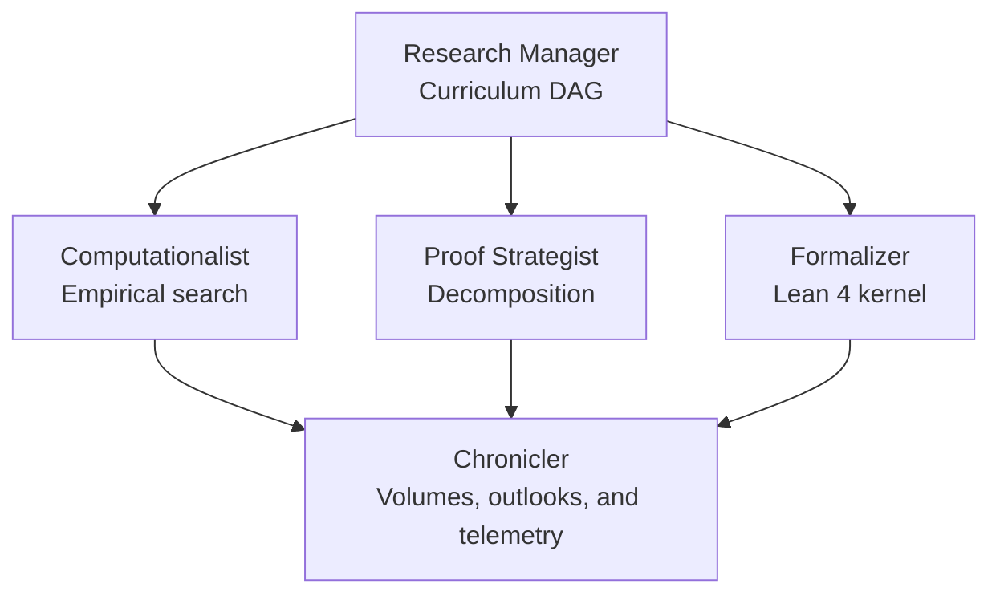
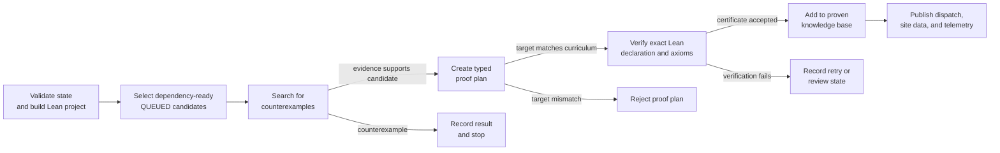
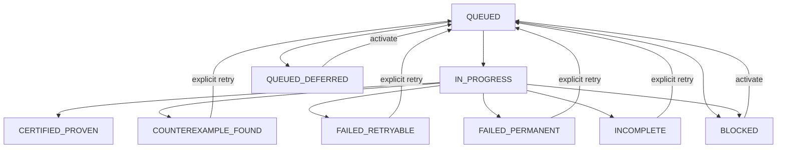
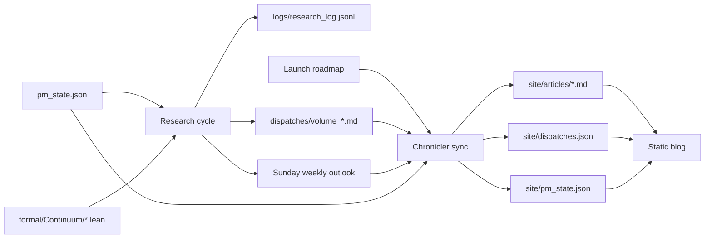

# The Daily Palindrome

The Daily Palindrome is an autonomous research blog and a reproducible research pipeline for palindromic number theory. Python coordinates a curriculum of candidate results, computational searches look for counterexamples, Lean 4 checks exact declarations, and a static website publishes the resulting dispatches.

The system deliberately separates evidence from proof. A successful numerical search allows a candidate to advance, but only the Lean verification stage can place it in the proven knowledge base.

## Architecture

### Responsibility topology

The Project Manager owns the curriculum and delegates work to specialist roles. Their outputs converge in the Chronicler, which produces the public research record.



This diagram describes ownership. Within one candidate run, the stages are gated and execute in order:



### Components

| Component | Responsibility | Primary output |
| --- | --- | --- |
| `main.py` | Orchestrates one research cycle and exposes the CLI | Cycle result and coordinated state changes |
| `agents/pm.py` | Validates the curriculum DAG, selects dependency-ready work, and enforces lifecycle transitions | `pm_state.json` |
| `agents/experimenter.py` | Constructs palindromes arithmetically in bases 2–16 and searches for counterexamples | Empirical result records |
| `agents/strategist.py` | Maps a candidate to a proof strategy and an exact Lean module/declaration target | Typed proof plan |
| `agents/formalizer.py` | Builds the Lean project, checks the named declaration, audits its axiom report, and emits a certificate | Verification certificate |
| `agents/chronicler.py` | Writes numbered volumes, Sunday outlooks, JSONL telemetry, and the static-blog indexes | `dispatches/`, `logs/`, and `site/` data |
| `formal/` | Contains the Lean definitions and theorems | Compiled Lean modules |
| `site/` | Serves the public blog, archives, About page, and architecture views | Static website |

## Curriculum and lifecycle

`pm_state.json` is the control plane. Each frontier item has a stable ID, tier, status, Lean target, dependency list, and optional empirical task. Before doing work, the Project Manager verifies that IDs are unique, dependencies exist, the dependency graph is acyclic, statuses are valid, and every proven ID points to an item in a proven state.

Only `QUEUED` items with proven dependencies are selected automatically. Deferred, blocked, or failed work requires an explicit activation or retry, preventing an unattended loop from repeatedly consuming the same bad task.



State files and generated indexes are written atomically. Corrupt state is reported rather than silently replaced. Each cycle also receives a unique run ID so its events can be correlated in `logs/research_log.jsonl`.

## Verification and certificate model

The Formalizer applies two checks:

1. `lake build` establishes that the complete Lean package compiles.
2. A temporary probe imports the configured module, checks the exact qualified declaration, and prints its axiom dependencies.

A certificate is accepted only when the command succeeds, the declaration exists, the output contains no Lean error or proof hole, and the axiom set is restricted to the configured Lean trust set (`propext`, `Quot.sound`, and `Classical.choice`). The certificate records:

- the module and qualified declaration;
- the Lean toolchain;
- the SHA-256 hash of the source module;
- the complete axiom report;
- unexpected-axiom and incomplete-proof flags; and
- a deterministic certificate ID derived from the evidence above.

This is stronger than treating a successful module build as proof that a particular theorem exists. It binds the research item to the named declaration and the source that was inspected.

## Publication data flow



The browser renders Markdown dispatches and mathematical notation, while the archives and research graph are driven by generated JSON. Article routes are allowlisted from `dispatches.json`, and rendered Markdown is sanitized before insertion into the page.

## Repository layout

```text
.
├── .github/workflows/ci.yml       # Python and Lean verification
├── .openai/hosting.json           # Sites project and static-output configuration
├── agents/                        # Research roles
├── dispatches/                    # Canonical Markdown articles
├── formal/                        # Lean 4 Lake package
│   └── Continuum/                 # Definitions and certified theorems
├── logs/research_log.jsonl        # Append-only research telemetry
├── scripts/build_static_site.mjs  # Copies the publishable site into dist/
├── site/                          # Static blog source and generated indexes
├── tests/                         # Python unit and contract tests
├── main.py                        # Orchestrator and CLI
└── pm_state.json                  # Persistent curriculum state
```

## Running locally

### Prerequisites

- Python 3.10 or newer
- Lean 4 through `elan`; the exact toolchain is pinned in `formal/lean-toolchain`
- Node.js only when preparing the static deployment directory

### Common commands

```bash
# Show the curriculum frontier and proven knowledge base
python -B main.py --status

# Execute one gated research cycle
python -B main.py --run-cycle

# Recheck every declaration in the proven knowledge base
python -B main.py --audit-certificates

# Publish the Research Manager's Weekly Research Outlook manually
python -B main.py --weekly-outlook

# Explicitly activate deferred/blocked work or retry a failed item
python -B main.py --activate CONJ-002
python -B main.py --retry CONJ-002

# Serve the blog locally
python -B main.py --serve --port 8765
```

The continuous harness stops when no actionable work remains and does not reactivate failed or deferred tasks on its own:

```bash
python -B main.py --continuous --interval 30 --max-cycles 5
```

## Testing and continuous integration

Run the Python suite and Lean checks locally:

```bash
python -B -m unittest discover -s tests -v
cd formal
lake build
cd ..
python -B main.py --audit-certificates
```

GitHub Actions repeats the Python tests, builds the pinned Lean package, and audits every recorded certificate on pushes and pull requests.

## Static deployment

The website is buildless at runtime. The deployment preparation script copies `site/` to the ignored `dist/` directory, preserving articles and generated JSON as relative static assets:

```bash
node scripts/build_static_site.mjs
```

The Sites manifest declares `dist/` as the public directory. Research source, tests, and Lean files remain in the repository but are excluded from the deployed web artifact.

## Scope and trust boundaries

- Empirical success is evidence, not proof; it only unlocks the formal stages.
- The strategist currently uses deterministic proof-plan templates for the supported curriculum rather than synthesizing arbitrary Lean proofs.
- A certificate verifies the configured declaration and its reported axiom dependencies; it does not assert that a prose summary is mathematically equivalent unless the curriculum mapping is correct.
- The frontend is static. KaTeX and Marked are loaded from pinned CDN versions, so rich article rendering requires network access in the reader's browser.
- The curriculum and trust policy are repository configuration. Changes to either should be reviewed like source code.
